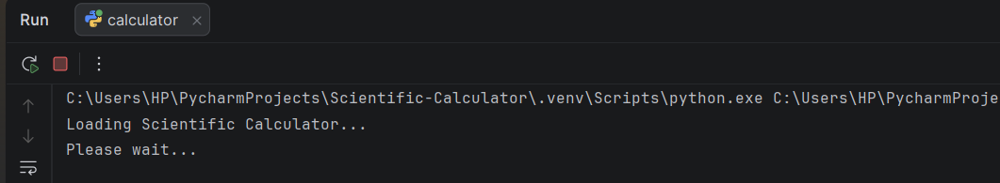
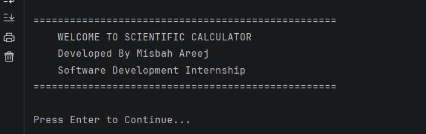
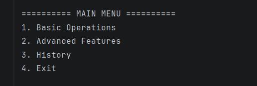
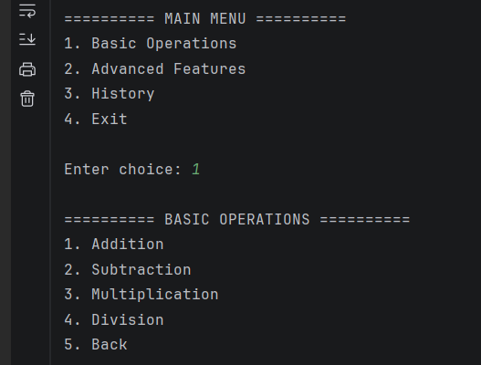
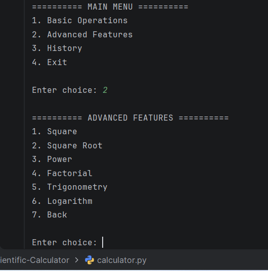
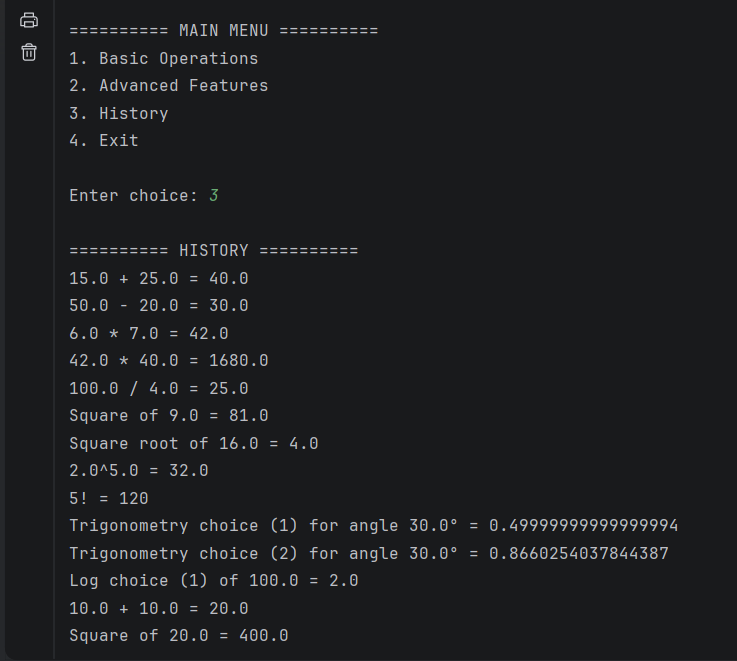
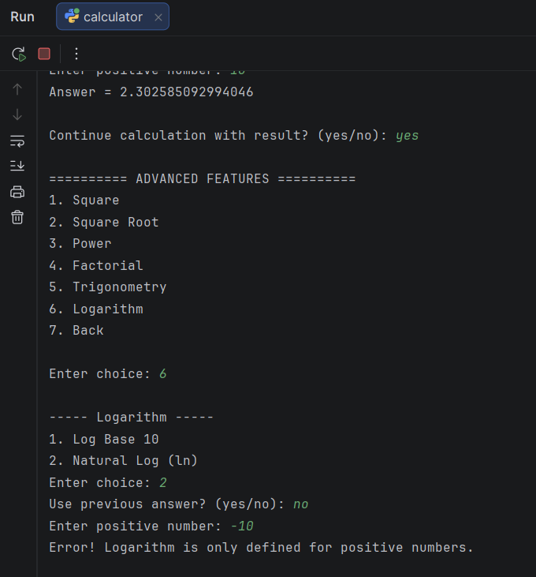
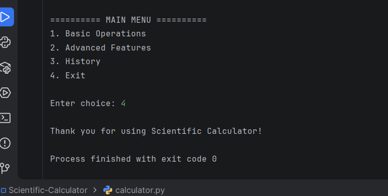

# 🧮 Scientific Calculator

A beginner-friendly Console-Based Scientific Calculator developed in Python as part of my Software Development Internship – Week 1 Project.

This project performs basic arithmetic operations as well as advanced mathematical calculations. It also includes calculation history, previous-answer reuse, input validation, and error handling.

---

## 👩‍💻 Project Information

Information| Details
Project Name| Scientific Calculator
Project Type| Console-Based Application
Programming Language| Python 
Internship| Software Development Internship
Week| Week 1 – Programming Basics
Developed By| Misbah Areej

---

## 📌 Project Overview

The Scientific Calculator is a Python-based command-line application designed to perform different types of mathematical calculations.

The calculator provides a simple menu-driven interface where users can select basic or advanced operations. The application also remembers the previous calculation result and stores completed calculations in a history section.

This project was developed to practice fundamental Python programming concepts such as:

- Functions
- Conditional Statements
- Loops
- User Input
- Exception Handling
- Lists
- Mathematical Operations
- Python Modules
- Input Validation

---

## ✨ Features

### 🔢 Basic Operations

The calculator supports:

- Addition
- Subtraction
- Multiplication
- Division

### 🧮 Advanced Features

The calculator also provides:

- Square
- Square Root
- Power
- Factorial
- Trigonometry
  - Sin
  - Cos
  - Tan
- Logarithm
  - Log Base 10
  - Natural Log (ln)

### 📋 Calculation History

All successful calculations are stored in the history section during the current program session.

### 🔄 Previous Answer

The calculator allows the user to reuse the previous calculation result in a new calculation.

### 🛡️ Input Validation

The program validates user input and prevents invalid values from crashing the application.

### ⚠️ Error Handling

The calculator handles common errors such as:

- Division by zero
- Square root of negative numbers
- Invalid logarithm values
- Negative factorial values
- Invalid menu choices
- Invalid numeric input
- Undefined tangent values

---

## 🛠️ Technologies Used

- Python 3
- Math Module
- Visual Studio Code
- GitHub

---
## 📂 Project Structure

```text
Scientific-Calculator/
│
├── calculator.py
│
├── screenshots/
│   ├── 01_Loading_Welcome.png
│   ├── 03_Main_Menu.png
│   ├── 04_Basic_Operations.png
│   ├── 10_Advanced_Features.png
│   ├── 22_History.png
│   ├── 20_Error_Handling.png
│   └── 24_Exit_Screen.png
│
└── README.md
```

---

## ▶️ How to Run

Step 1: Install Python

Make sure Python 3 is installed on your computer.

Step 2: Open the Project

Open the project folder in Visual Studio Code.

Step 3: Open the Terminal

Open the terminal in Visual Studio Code.

Step 4: Run the Program

Run the following command:

python calculator.py

The Scientific Calculator will start in the terminal.

---

## 📖 How to Use

After starting the program:

1. The loading and welcome screen will appear.
2. Press Enter to continue.
3. Select an option from the Main Menu.
4. Choose a basic or advanced operation.
5. Enter the required numbers.
6. View the calculation result.
7. Continue using the previous answer if required.
8. Check the calculation history whenever needed.
9. Select Exit when finished.

---

### 🧾 Main Menu

The calculator contains the following main options:

========== MAIN MENU ==========

1. Basic Operations
2. Advanced Features
3. History
4. Exit

---

### 🔢 Basic Operations Menu

========== BASIC OPERATIONS ==========

1. Addition
2. Subtraction
3. Multiplication
4. Division
5. Back

---

### 🧮 Advanced Features Menu

========== ADVANCED FEATURES ==========

1. Square
2. Square Root
3. Power
4. Factorial
5. Trigonometry
6. Logarithm
7. Back

---

### 🔄 Previous Answer Feature

The calculator provides a Previous Answer feature.

After completing a calculation, the user can choose to reuse the previous result instead of entering the first number again.

Example:

Answer = 25.0

Use previous answer? (yes/no):

This makes consecutive calculations easier and faster.

---

### 📋 History Feature

The calculator stores successful calculations during the current program session.

Example:

========== HISTORY ==========

5.0 + 10.0 = 15.0
15.0 * 2.0 = 30.0
Square of 30.0 = 900.0

This allows the user to review previously performed calculations.

---

### 🛡️ Error Handling

The application includes several safety checks to provide a better user experience.

Division by Zero

Error! Division by zero is not allowed.

Negative Square Root

Error! Cannot calculate square root of a negative number.

Invalid Logarithm

Error! Logarithm is only defined for positive numbers.

Invalid Input

Invalid input! Please enter a valid number.

Negative Factorial

Error! Factorial is not defined for negative numbers.

---

## 📸 Screenshots

1. Loading and Welcome Screen




---

2. Main Menu



---

3. Basic Operations


---

4. Advanced Features


---

5. Calculation History


---

6. Error Handling


---

7. Exit Screen


---

## 🎯 Learning Outcomes

Through this project, I practiced and improved my understanding of:

- Python programming fundamentals
- Creating and using functions
- Working with loops
- Using conditional statements
- Handling user input
- Exception handling
- Lists and data storage
- Mathematical functions
- Using Python's "math" module
- Building menu-driven applications
- Implementing input validation
- Implementing error handling
- Organizing code into reusable functions
- Using GitHub for project management

---

## 🚀 Future Improvements

Some possible improvements for future versions include:

- Graphical User Interface (GUI)
- More scientific functions
- Permanent history storage
- Clear History option
- Better formatted results
- Keyboard shortcuts
- Calculation history export
- More advanced mathematical operations

---

## 💡 Project Highlights

This project demonstrates the practical use of Python fundamentals in a real-world style application.

The main focus was to create a calculator that is:

- Simple to use
- Easy to understand
- Interactive
- Reliable
- Error-resistant
- Beginner-friendly
- Well-organized

---

## 👩‍💻 Author

Misbah Areej

BS Information Technology Student
Software Development Internship

---

## ⭐ Conclusion

The Scientific Calculator was developed as my Week 1 Software Development Internship Project to apply basic Python programming concepts in a practical application.

The project helped me understand how programming concepts such as functions, loops, conditional statements, input validation, exception handling, and modules can be combined to build a complete console-based application.

---

## ⭐ Thank you for visiting this project!
